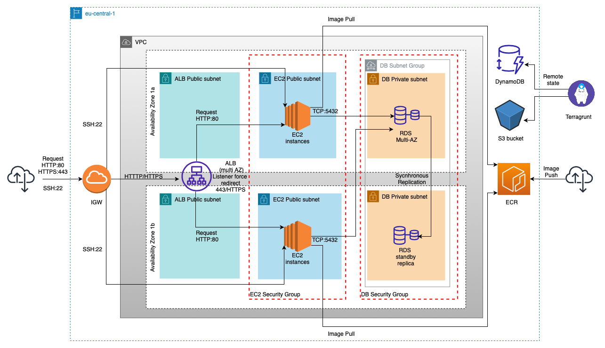

# Simple HA infrastructure project

- [Simple HA infrastructure project](#simple-ha-infrastructure-project)
  - [About Project](#about-project)
  - [Quick start](#quick-start)
    - [Requirements for playing with CRUD:](#requirements-for-playing-with-crud)
    - [Run crud application locally](#run-crud-application-locally)
    - [Test examples using Curl](#test-examples-using-curl)
  - [Requirements for deploying CRUD application on Amazon Web Services](#requirements-for-deploying-crud-application-on-amazon-web-services)
  - [Overview of Architecture](#overview-of-architecture)
  - [AWS services](#aws-services)
  - [How to provision infra](#how-to-provision-infra)
    - [AWS account](#aws-account)
    - [SSH key pair](#ssh-key-pair)
    - [Terraform](#terraform)
    - [Ansible](#ansible)
    - [How to manage app status and version using Ansible](#how-to-manage-app-status-and-version-using-ansible)
  - [The end](#the-end)

## About Project
This project purpose is purely educational and is created with the intention of using commonly used technologies to create simple HA infrastructure on AWS (mostly free tier services). 
The main goal's and use cases are:
- Creating and playing with localy containerized CRUD (create, read, update, delete) application using DockerCompose.
- Provisioning of an application using Terragrunt (for easy s3 remote state) with custom options as variables.
- Configure instances (EC2) and pull image from registry using Ansible.

## Quick start
### Requirements for playing with CRUD:
Install the following software:
* [Git](https://git-scm.com/book/en/v2/Getting-Started-Installing-Git)
* [Docker](https://docs.docker.com/engine/install/) >= v20.10 ; must-have to run and test locally containerized application (it comes bundled with [Docker-Compose](https://docs.docker.com/compose/install/))
* [Postman](https://www.postman.com/) as an optional tool to use instead of *Curl* command to interact with application endpoints.
  
Clone repository using the below command:

    gh repo clone DudeBeCool/crud-ha-project

### Run crud application locally
The following steps will guide you through building an application image, running it, and local tests.
1. To run and build the python application locally in *--detach* mode, type:

    ```bash
    docker compose up --build -d
    ```

2. Check running containers:

    ```bash
    docker compose ps
    ```

**You should see both containers up and running (DB & Pythonapp)**
4. All core changes regarding appliction features and endpoints should be made directly in [app.py](app.py) file.
   
5. Any change in [app.py](app.py) file will reload the container and adapt all changes that were made thanks to *docker live reload* compose configuration.
   
6. To test the applicationyou can choose from one of three methods:
    * [6.1] use *Curl* command based on json structure you based on provided examples
    * [6.2] use **POSTMAN** software to create collection of CRUD request
    * [6.3] if you only want to check application status go ahead and use your web browser for URL: *http://localhost:8080/healthz* it should confirm if application is up and running

### Test examples using Curl
1. Add product:

    ```bash
    curl -X POST http://localhost:8081/product -H "Content-Type: application/json" -d '{"product": "NewProduct", "stock": "999"}'
    ```

    OUTPUT (after more than one same request):

    ```bash
    {"msg":"This product name is already taken, can't be added again","status_code":409}
    ```

2. List all existing products:

    ```bash
    curl -X http://localhost:8081/product
    ```

    OUTPUT:
    ```bash
    [{"product":"First_product1","stock":"1"},{"product":"First_product2","stock":"2"},{"product":"First_product3","stock":"3"}]
    ```

3. Add product (AWS) remembe about "-k" flag to avoid SSL problems:

    ```bash
    curl -k -X POST https://<here_copy_your_alb_endpoint>/product -H "Content-Type: application/json" -d '{"product": "SwordofaThousandTruths", "stock": "666"}'
    ```

    OUTPUT:
    ```bash
    {"msg":"Sucessfully added a new product","status_code":200}
    ```


## Requirements for deploying CRUD application on Amazon Web Services
Install the following software:
* [Git](https://git-scm.com/book/en/v2/Getting-Started-Installing-Git)
* [Awscli v2](https://docs.aws.amazon.com/cli/latest/userguide/getting-started-install.html)
* [Terraform](https://learn.hashicorp.com/tutorials/terraform/install-cli)
* [Terragrunt](https://terragrunt.gruntwork.io/docs/getting-started/install/)
* [Ansible](https://docs.ansible.com/ansible/latest/installation_guide/intro_installation.html)
* [Postman](https://www.postman.com/) *as an optional tool to use instead of* *Curl* *command to interact with application endpoints*

## Overview of Architecture


## AWS services
Key components used from AWS (eu-central-1 region):

* **EC2** as a VM's running containers
* **ALB** as a HTTPS over HTTP and round robin algorithm
* **VPC** with 5 subnets in 2 different zones A/B
* **RDS** as a database instance
* **ECR** to store image
* **S3** with **DYNAMO DB** to store terraform backend state

## How to provision infra
Follow these steps to provision application infrastructure from a scratch:

### AWS account
Guide to setup your AWS account if you don't have one already configured. 
1. Login to your [AWS Console](https://console.aws.amazon.com/console/home?nc2=h_ct&src=header-signin)
2. During the first login you will be prompt to change the password
3. Generate [access keys](https://docs.aws.amazon.com/powershell/latest/userguide/pstools-appendix-sign-up.html). 
4. Configure named [AWS Profile](https://docs.aws.amazon.com/cli/latest/userguide/cli-configure-quickstart.html) for CLI. 
   The easiest way (region: eu-central-1):
   ```bash
   aws configure --profile name-of-your-profile
   ```
    > Remember to use appropriate AWS profile which suits the needs of this project.

### SSH key pair
1. Create new SSH key pair using command:
    ```bash
    ssh-keygen
    ```
2. Save your new key pair under the location */your_home/.ssh/aws/name_of_your_key* for later.

### Terraform
**STEPS**
1. Ensure that during all steps you are on [Terraform](terraform/) directory.
2. Verify the installation by listing Terraform's available subcommands.
    ```bash
    terragrunt -help
    ```
    >If you get an error that terraform/terragrunt could not be found please go back and ensure that your PATH variable/software was installed properly.
3. To use your IAM credentials to authenticate the Terraform AWS provider, set the *AWS_ACCESS_KEY_ID() environment variable.
    ```bash
    export AWS_ACCESS_KEY_ID=
    ```
4. Now, set your secret key.
    ```bash
    export AWS_SECRET_ACCESS_KEY=
    ```
5. Configure terraform [variables.tf](terraform/variables.tf) according to your needs.
    **Obligatory values** 
    - "public_key" - your public SSH key
    - "password"   - database (RDS service) password to save for later

    **Configuration** 
    - [5.1] leave it be and pass those obligatory variables during infrastructure provision *terraform apply* using the *-var* flag
        ```bash
        terraform apply \
        -var '<input-variable-name>=<value>'
        ```
    - [5.2] create *prefix.auto.tfvars* file in [terraform location](terraform) with values to load them automatically during each provision        
        ```bash
        public_key=<your_public_key>
        password=<password_for_rds>
        ```
6. Initialize your backend using command:
    ```bash
    terragrunt init
    ```
7.  Provision your infrastructure using command:
    ```bash
    terragrunt apply
    ```
    > type **yes** to confirm

8.  Check provisioned resources using command:
    ```bash
    terragrunt state list
    ```

    > From now on you should be able to SSH to newly provisioned instances using private key created for purpose of this project. To list public_dns of instances use command:

    ```bash
    terraform output
    ```
    >To SSH using terminal use command:
    ```bash
    ssh -i */your_home/.ssh/aws/name_of_your_key* <user>@<public_dns>
    ```

### Ansible

**STEPS**
1. Ensure that during all steps you are on [Ansible](ansible/) directory.
2. Verify the installation by listing Ansible available subcommands.
    ```bash
    ansible-help
    ```
    >If you get an error that ansible could not be found, your PATH environment variable was not set up or installed properly.

3. Use your private key to establish connection between AWS EC2 instance and ansible during playbook command:
    - [3.1] add your private key to ssh-agent
    ```bash
    ssh-add /your_home/.ssh/aws/name_of_your_private_key
    ```

    - [3.2] use *--private-key* flag during all ansible commands e.g. below
    ```bash
    ansible-playbook --private-key /your_home/.ssh/aws/name_of_your_private_key ec2_setup.yaml -i inventory.ini
    ```

4. Configure EC2 instances using command:
    ```bash
    ansible-playbook --private-key /your_home/.ssh/aws/name_of_your_private_key ec2_crud_mgmt.yaml -i inventory.ini
    ```
    >If you get an error related to connection establish go back to previous paragraph and ensure proper *private_key* is passed during command/session.


### How to manage app status and version using Ansible
1. Push desired application image to ECR repository using:
   - [1.1] login to your [AWS Console](https://console.aws.amazon.com/console/home?nc2=h_ct&src=header-signin) and follow ECR push command guideline
   - [1.2] use *terraform output* command and pass ECR secrets and URL (variables) to Gitlab repository then run pipeline on desired branch/version

    > both methods will guide you through building new image from current [Dockerfile](Dockerfile) directory
    > **CI configuration** allows keeping state of application up to date during any changes by pushing newest image version to both Gitlab and AWS registry each time pipeline is successfully run.

2. Start your application using command:
    ```bash
    ansible-playbook restapi_mgmt.yaml -i inventory.yaml
    ```
3. To test endpoints of application you can choose from one of three methods:
    * [3.1] use *Curl* command based on given examples
    * [3.2] use **POSTMAN** software to create collection of CRUD request
    * [3.3] login to your [AWS Console](https://console.aws.amazon.com/console/home?nc2=h_ct&src=header-signin) and check the state of health-check at target group

4. To manage container state add a proper line/variable to [Inventory](ansible/inventory.ini) *container_state*=**desired_state** (possible options):
    * [present] - run container
    * [started] - default state run-and-reload container if necessary (newer image is available)
    * [stopped] - used to stop container
    * [absent] - to remove container and all volumes&images

5. Than run:
    ```bash
    ansible-playbook ec2_crud_mgmt.yaml -i inventory.yaml
    ```
    > restart and pull flag in inventory will ensure that newest image is always run if container state is equal to **started**

## The end
Thanks for your time, hope you enjoy our journey!
